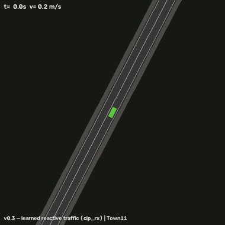
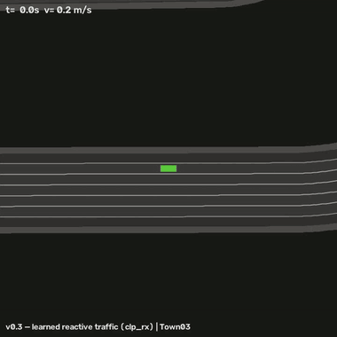
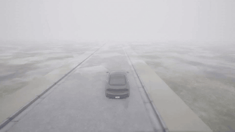
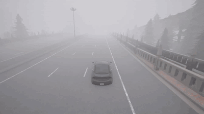

# DITTO-AV: Offline Imitation Learning with World Models for Autonomous Driving

Closed-loop imitation learning for driving, trained **entirely offline**. The
policy is never rolled out in a simulator during training: it is trained
on-policy inside a world built from the recorded logs themselves, and rewarded
for staying close to what the expert did in that same scene. Built on **DITTO**
([DeMoss et al., 2023](https://arxiv.org/abs/2302.03086)).

**The problem.** Behavior cloning breaks under covariate shift — it never sees
its own mistakes, so it never learns to recover. The usual fixes cost either an
online simulator or a learned model of the entire scene, which the policy then
exploits.

**The approach.**

1. **Factor the world.** The ego moves by analytic kinematics — never learn
   what is already known. Everything exogenous (traffic, route, lights) comes
   from the log, either replayed directly or advanced by a learned traffic
   model.
2. **Reward only what the agent controls.** A time-tolerant kernel matches the
   simulated ego's state — position, heading, speed — against the expert's in
   the same scene. No traffic enters the reward, so there is nothing to game.
   Off the expert path, reward is earned by *returning* to it: the recovery
   incentive behavior cloning cannot represent.
3. **Let the simulator be the judge, never the trainer.** Bench2Drive
   closed-loop in CARLA is the only verdict; the training world never grades
   itself.

## Status — under active development

The numbers below are current measurements, not final results, and are updated
periodically as runs land. Scores are Bench2Drive closed-loop **driving score
(DS)** in CARLA. Full per-run ledgers with job ids live in `V02_PLAN.md`,
`V03_PLAN.md`, and `V031_PLAN.md`.

| line | training world | current DS | state |
|---|---|---|---|
| v0.1 | learned RSSM latent; reward = whole-latent match | 22.10 (220 routes) | frozen |
| v0.2 | log replayed as the world; reward = ego-state match | 76.10 / 75.88 (220 routes); 85.63 / 83.60 (dev-10) | frozen |
| v0.3 | v0.2 + learned reactive traffic model | 82.53 (dev-10) | frozen |
| v0.3.1 | v0.3 + static map geometry | 66.01 / 74.89 (dev-10) | reopened |
| v0.3.2 | v0.3 + smoothness reward channels | in progress | active |

Two arms are reported where two seeds/configs were run. **dev-10** is the
development gate: 10 Bench2Drive routes (A-half 3514, 3255, 26405, 25381,
25378; B-half 25424, 2091, 27494, 17569, 28198) × 3 repetitions = 30 runs.
**220 routes** is the full Bench2Drive closed-loop benchmark, run only on a
model that has already cleared dev-10.

### What separates the versions

Each version changes what the training world is made of, and therefore what the
reward can grade. v0.1 unrolled a learned RSSM latent and matched the whole
latent, which mostly graded traffic rather than driving. v0.2 replays the
logged clip as the world, moves the ego analytically, and grades only the ego's
own state. v0.3 keeps that and returns agency to the traffic through a learned
per-agent model, so other vehicles react to the ego.

v0.2 and v0.3 differ almost entirely in *which* collisions they have:

| dev-10 collisions | v0.2 | v0.3 |
|---|---|---|
| with vehicles | 9 / 12 | **6** |
| with static layout | 0 / 1 | 7 |

v0.3's reactive traffic reduces vehicle collisions by 33–50%. Its training
world contains no static geometry, so driving close to walls costs nothing
during training and costs 7 layout collisions in CARLA. v0.3.1 added road
geometry to close that gap and did not: the objects actually hit are map
furniture — fences, props, vegetation — standing *on* drivable area, which a
lane-based drivability signal cannot express. That axis is now reopened, since
CARLA does expose the collidable furniture offline even though the annotations
and OpenDRIVE do not.

### Videos

Closed-loop CARLA rollouts, same routes rendered for both versions. `2d` is the
bird's-eye state render, `3d` is the CARLA camera. These are the dev-10 routes
that both versions complete cleanly — **DS 100, route completion 100%, no
collisions** — spanning five towns and five scenario types. The routes that
still fail are the ones in the collision table above; these clips show what the
policy does when it works, on in-development checkpoints rather than a finished
system.

| route | town | scenario | v0.2 | v0.3 |
|---|---|---|---|---|
| 25378 | Town03 | yield to emergency vehicle | [2d](docs/media/v02_route25378_2d.mp4) · [3d](docs/media/v02_route25378_3d.mp4) | [2d](docs/media/v03_route25378_2d.mp4) · [3d](docs/media/v03_route25378_3d.mp4) |
| 25381 | Town05 | hazard at side lane | [2d](docs/media/v02_route25381_2d.mp4) · [3d](docs/media/v02_route25381_3d.mp4) | [2d](docs/media/v03_route25381_2d.mp4) · [3d](docs/media/v03_route25381_3d.mp4) |
| 25424 | Town11 | construction obstacle, two-way road | [2d](docs/media/v02_route25424_2d.mp4) · [3d](docs/media/v02_route25424_3d.mp4) | [2d](docs/media/v03_route25424_2d.mp4) · [3d](docs/media/v03_route25424_3d.mp4) |
| 26405 | Town15 | static cut-in | [2d](docs/media/v02_route26405_2d.mp4) | [2d](docs/media/v03_route26405_2d.mp4) |
| 17569 | Town12 | sequential lane change | [2d](docs/media/v02_route17569_2d.mp4) | [2d](docs/media/v03_route17569_2d.mp4) |

Four v0.3 rollouts preview inline below (GitHub strips `<video>` tags, so these
are looping GIFs — the table above links the full-quality mp4s).

**Bird's-eye (2d).** Left: construction obstacle on a two-way road, Town11.
Right: yielding to an emergency vehicle, Town03.

<table>
<tr>
<td width="50%"></td>
<td width="50%"></td>
</tr>
</table>

**CARLA camera (3d).** Left: construction obstacle, two-way road, Town11.
Right: hazard at side lane, Town05.

<table>
<tr>
<td width="50%"></td>
<td width="50%"></td>
</tr>
</table>

### Next experiments (todo)

- **E3 — factored-latent retest**: latent matching inside the
  (ego | learned-traffic) factorization, closing the question v0.1 opened.
- **v0.3.2 smoothness**: yaw-rate reward channel, then an in-world plan-churn
  penalty and a policy-side temporal-consistency loss.
- **220-route run** for the v0.3 line, once a dev-10 gate is cleared.
- **Paper** covering the v0.2 result, the v0.3 collision decomposition, and the
  v0.3.1 negative result.

## Layout

```text
ditto_av/            the package (self-contained)
  egosim.py          the training world: log replay + analytic ego kinematics
  reactive.py        learned traffic model, autoregressive rollout (v0.3+)
  layout.py          static map geometry from OpenDRIVE; layout_torch.py = torch port
  rewards.py         ego-state matching kernels, latent matching, lambda-returns
  tracks.py          expert trajectory targets; tracker_torch.py = pure-pursuit tracker
  models/            RSSM (categorical latents), vector encoder/decoder, actor-critic
  trainers/          world-model, DITTO actor-critic, BC trainers
  evaluate.py        closed-loop evaluation harness
  bench2drive.py     Bench2Drive (CARLA) -> DITTO-AV data adapter
  carla_agent.py     deployment agent for the CARLA leaderboard
  envs.py            highway-env factory + vector featurizer (dev benchmark)
  expert.py          scripted two-style (multimodal) expert for highway-env
scripts/run_pipeline.py   A-to-Z pipeline
scripts/slurm/            cluster jobs (training, CARLA eval, video rendering)
configs/av.yaml           main experiment; configs/smoke.yaml for a 2-min test
tests/                    pytest suite
src/, paper/              original DITTO Atari code + paper (reference, untouched)
```

## Quickstart

```sh
pip install -r requirements_av.txt
python -m pytest tests/ -q                     # sanity
python scripts/run_pipeline.py --config configs/smoke.yaml --stage all   # ~2 min
python scripts/run_pipeline.py --config configs/av.yaml --stage all      # full run
```

Stages can be run individually: `--stage collect | wm | policies | eval`.
Results land in `runs/<name>/results/results.md`.

## Data

- **highway-env** (bundled, procedural): the development benchmark. A
  scripted expert with two styles (aggressive = overtakes, conservative =
  slows down) produces genuinely multimodal demonstrations; a noisy variant
  adds world-model coverage.
- **Bench2Drive** ([HuggingFace](https://huggingface.co/datasets/rethinklab/Bench2Drive),
  Apache-2.0): the paper benchmark. `ditto_av/bench2drive.py` converts clips
  (per-frame annotation JSONs) into the same vectorized format:

```python
from ditto_av.bench2drive import clips_to_npz
clips_to_npz([Path("clips/AccidentTwoWays_..._Weather10")], "runs/b2d/data/expert.npz")
```

See `V02_PLAN.md`, `V03_PLAN.md`, and `V031_PLAN.md` for the plans, experiment
matrices, pre-registered gates, and status ledgers of each version.

## Performance note

Set single-threaded BLAS (`torch.set_num_threads(1)`, done automatically in
`scripts/run_pipeline.py`) — the small sequential RSSM ops are 15-30x slower
under multi-threaded BLAS on Apple Silicon.

## Credit: original DITTO

This project began as a fork of and builds directly on
[**DITTO** by Branton DeMoss et al.](https://github.com/brantondemoss/DITTO)
([paper: *DITTO: Offline Imitation Learning with World Models*, arXiv:2302.03086](https://arxiv.org/abs/2302.03086)).
The RSSM world-model core in `ditto_av/models/` is adapted from that
codebase, and the original pre-release Atari implementation is preserved
unchanged in `src/` with the paper sources in `paper/`. If you use the
world-model imitation ideas here, please cite DITTO:

```bibtex
@article{demoss2023ditto,
  title={DITTO: Offline Imitation Learning with World Models},
  author={DeMoss, Branton and Duckworth, Paul and Hawes, Nick and Posner, Ingmar},
  journal={arXiv preprint arXiv:2302.03086},
  year={2023}
}
```
