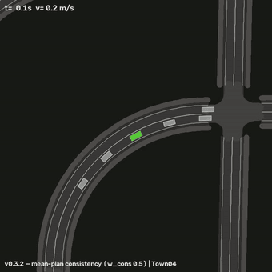
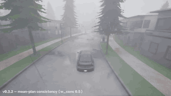
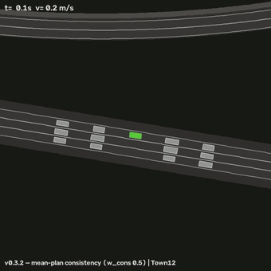
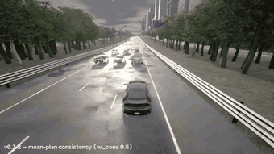
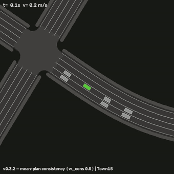
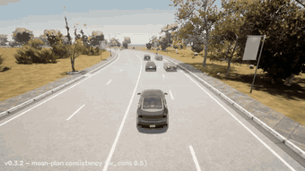

# DITTO-AV: Offline Imitation Learning with World Models for Autonomous Driving

This repository adapts **DITTO** ([DeMoss et al., 2023](https://arxiv.org/abs/2302.03086),
offline imitation learning inside a learned world model) to **autonomous
driving**, with a driving-native factorization of the world and its reward.

**Core idea.** Build a world model from offline driving logs. Then learn a
policy *fully offline* by unrolling it inside that world from expert start
states and rewarding closeness to expert trajectories — on-policy imitation
without a simulator, which corrects the covariate shift that breaks behavior
cloning.

## Status — under active development

The numbers below are current measurements, not final results, and are updated
periodically as runs land. Scores are Bench2Drive closed-loop **driving score
(DS)** in CARLA. Full per-run ledgers with job ids live in `V02_PLAN.md`,
`V03_PLAN.md`, and `V031_PLAN.md`.

| line | training world | current DS | state |
|---|---|---|---|
| v0.1 | learned RSSM latent; reward = whole-latent match | 22.10 (full 220 routes) | frozen |
| v0.2 | log replayed as the world; reward = ego-state match | 76.10 / 75.88 (full 220 routes); 85.63 / 83.60 (test-10) | frozen |
| v0.3 | v0.2 + learned reactive traffic model | 82.53 (test-10) | frozen |
| v0.3.1 | v0.3 + static map geometry | 66.01 / 74.89 (test-10) | reopened |
| v0.3.2 | v0.3 + plan-consistency (smoothness) reward | 82.80 (test-10) | active |

Two variants are reported where two seeds/configs were run. **test-10** is the
development gate: 10 Bench2Drive routes (A-half 3514, 3255, 26405, 25381,
25378; B-half 25424, 2091, 27494, 17569, 28198) × 3 repetitions = 30 runs.
**full 220 routes** is the complete Bench2Drive closed-loop benchmark, run only
on a model that has already cleared test-10.

v0.3.2's measured variant drives *smoother than the expert* — 6.7 steering sign
flips per 100 ticks against the expert's 9.8 and v0.3's 18.1 — and takes its
static-layout collisions from 7 to 0 with no map data at all, which reframes
v0.3.1's negative: the wobble was the furniture-hitting mechanism, not missing
geometry. It is not banked, because the same commitment that kills the wobble
costs half the reactivity dividend: vehicle collisions 6 -> 12 against a
pre-registered ceiling of 8.

### Videos

**Preliminary results from ongoing work — in-development checkpoints, not a
finished system.**

Closed-loop CARLA rollouts of the **v0.3.2** policy (mean-plan consistency,
`w_cons` 0.5) on three routes it completes without collisions. Each pair is ONE
run recorded two ways: the bird's-eye view is the simulated state drawn over
the town's OpenDRIVE geometry, the camera view is CARLA. Previews are trimmed
GIFs; full-quality mp4s are in [docs/media/](docs/media/).

<table>
<tr>
<td width="50%"></td>
<td width="50%"></td>
</tr>
<tr><td colspan="2" align="center"><sub>Town04 · <a href="docs/media/v032_route27494_2d.mp4">2d</a> · <a href="docs/media/v032_route27494_3d.mp4">3d</a></sub></td></tr>
<tr>
<td width="50%"></td>
<td width="50%"></td>
</tr>
<tr><td colspan="2" align="center"><sub>Town12 · <a href="docs/media/v032_route17569_2d.mp4">2d</a> · <a href="docs/media/v032_route17569_3d.mp4">3d</a></sub></td></tr>
<tr>
<td width="50%"></td>
<td width="50%"></td>
</tr>
<tr><td colspan="2" align="center"><sub>Town15 · <a href="docs/media/v032_route26405_2d.mp4">2d</a> · <a href="docs/media/v032_route26405_3d.mp4">3d</a></sub></td></tr>
</table>

## Layout

```text
ditto_av/            the package (self-contained)
  egosim.py          the training world: log replay + analytic ego kinematics
  reactive.py        learned traffic model, autoregressive rollout (v0.3+)
  layout.py          static map geometry from OpenDRIVE; layout_torch.py = torch port
  rewards.py         ego-state matching kernels, latent matching, lambda-returns
  tracks.py          expert trajectory targets; tracker_torch.py = pure-pursuit tracker
  models/            RSSM (categorical latents), vector encoder/decoder, actor-critic
  trainers/          world-model, DITTO actor-critic, BC trainers
  evaluate.py        closed-loop evaluation harness
  bench2drive.py     Bench2Drive (CARLA) -> DITTO-AV data adapter
  carla_agent.py     deployment agent for the CARLA leaderboard
  envs.py            highway-env factory + vector featurizer (dev benchmark)
  expert.py          scripted two-style (multimodal) expert for highway-env
scripts/run_pipeline.py   A-to-Z pipeline
scripts/slurm/            cluster jobs (training, CARLA eval, video rendering)
configs/av.yaml           main experiment; configs/smoke.yaml for a 2-min test
tests/                    pytest suite
src/, paper/              original DITTO Atari code + paper (reference, untouched)
```

## Quickstart

```sh
pip install -r requirements_av.txt
python -m pytest tests/ -q                     # sanity
python scripts/run_pipeline.py --config configs/smoke.yaml --stage all   # ~2 min
python scripts/run_pipeline.py --config configs/av.yaml --stage all      # full run
```

Stages can be run individually: `--stage collect | wm | policies | eval`.
Results land in `runs/<name>/results/results.md`.

## Data

- **highway-env** (bundled, procedural): the development benchmark. A
  scripted expert with two styles (aggressive = overtakes, conservative =
  slows down) produces genuinely multimodal demonstrations; a noisy variant
  adds world-model coverage.
- **Bench2Drive** ([HuggingFace](https://huggingface.co/datasets/rethinklab/Bench2Drive),
  Apache-2.0): the paper benchmark. `ditto_av/bench2drive.py` converts clips
  (per-frame annotation JSONs) into the same vectorized format:

```python
from ditto_av.bench2drive import clips_to_npz
clips_to_npz([Path("clips/AccidentTwoWays_..._Weather10")], "runs/b2d/data/expert.npz")
```

See `V02_PLAN.md`, `V03_PLAN.md`, and `V031_PLAN.md` for the plans, experiment
matrices, pre-registered gates, and status ledgers of each version.

## Performance note

Set single-threaded BLAS (`torch.set_num_threads(1)`, done automatically in
`scripts/run_pipeline.py`) — the small sequential RSSM ops are 15-30x slower
under multi-threaded BLAS on Apple Silicon.

## Credit: original DITTO

This project began as a fork of and builds directly on
[**DITTO** by Branton DeMoss et al.](https://github.com/brantondemoss/DITTO)
([paper: *DITTO: Offline Imitation Learning with World Models*, arXiv:2302.03086](https://arxiv.org/abs/2302.03086)).
The RSSM world-model core in `ditto_av/models/` is adapted from that
codebase, and the original pre-release Atari implementation is preserved
unchanged in `src/` with the paper sources in `paper/`. If you use the
world-model imitation ideas here, please cite DITTO:

```bibtex
@article{demoss2023ditto,
  title={DITTO: Offline Imitation Learning with World Models},
  author={DeMoss, Branton and Duckworth, Paul and Hawes, Nick and Posner, Ingmar},
  journal={arXiv preprint arXiv:2302.03086},
  year={2023}
}
```
